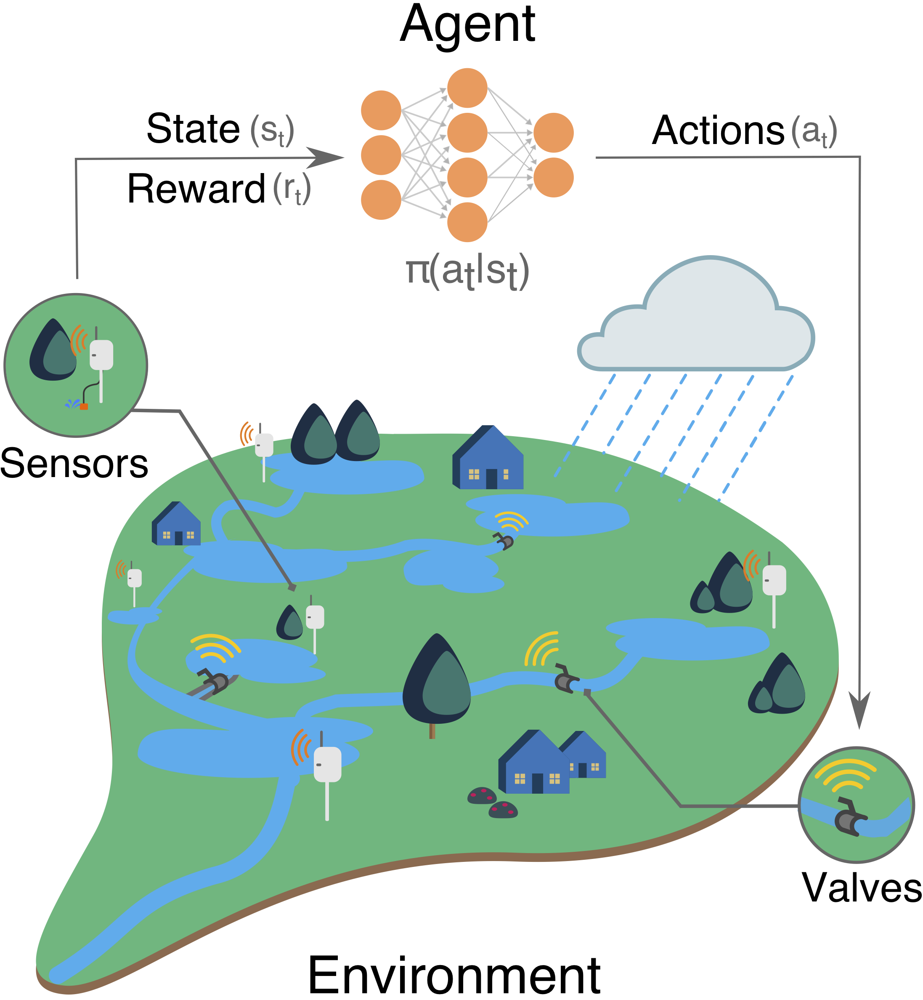

## Deep RL Agent for the RTC of Storm Water System 

Source code and data used in the *Deep Reinforcement Learning for the Real Time Control of Stormwater Systems* paper. 

## Dependencies 
Code supports python 3.7 and python 2.7.

Python dependencies for the project can be installed using **requirements.txt**

Storm water network is simulated using EPA-SWMM and pyswmm/matswmm. Matswmm has been deprecated and we strongly suggest using pyswmm. 
 
pyswmm/matswmm makes function calls to a static c library. Hence, we advice gcc-8.0 for pyswmm and gcc-4.2 for matswmm. 

## Agents

#### Classical Q Learning 

Classical Q learning algorithm implementation for controlling the water level a single tank is provided in **classical_q**

This version observers the water level and sets the gate position between 0-100.

#### DQN
There are two types of deep rl agents.
1. Centralized controller that can observe multiple states across the network and control the ponds in the network 
2. Localised controller that can observe the state of an individual assent and control it 

To use these agents to control a storm water network, you would just need to know the ID(e.g. "1D" from the swmm input file).

Refer to the example implementation for further details.

#### Training

University of Michigan's FLUX was used to train the agents. They can be run on any local computer too, but we **strongly** recommend a GPU.

## Data presented in the paper

Weights of the neural network used for plots can be found in **./data**

## Utilities

Source code for generating heatmaps and other plots presented in the paper can be found in **./utilities**
 
## Further references 
1. Reinforcement Learning by Sutton and Barto
2. DQN
3. Batch Normalization 
