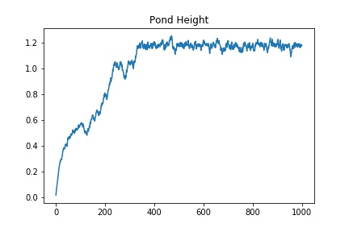
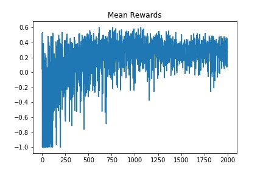
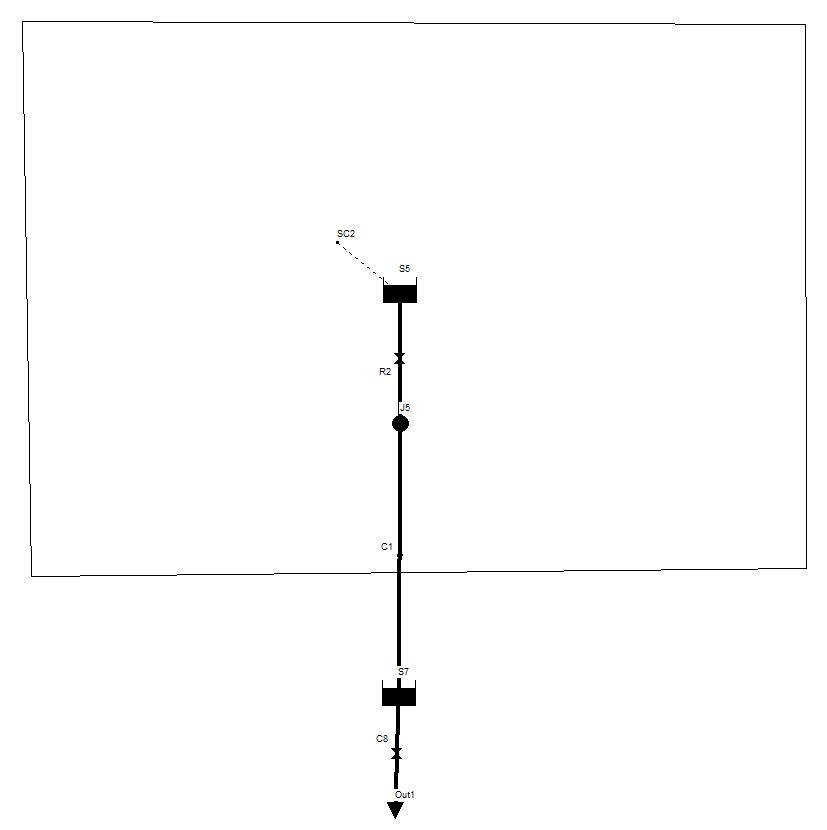
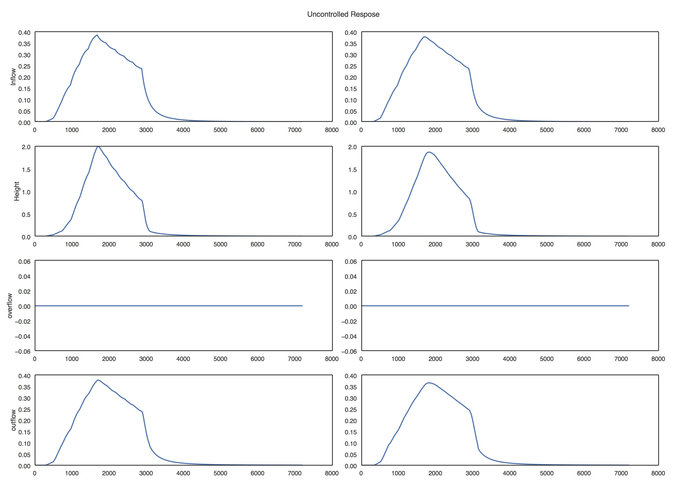
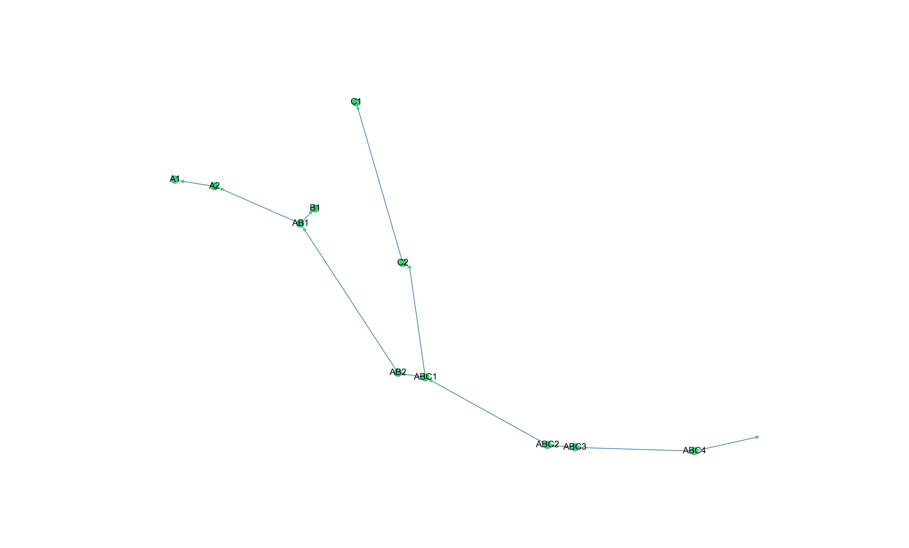

# Simulations
## Dependencies
1. Matswmm
2. tensorflow
3. keras

## Single pond
Classic Q learning[1] was used to train a controller to maintain a constant water level in the pond. Controller has the capability to alter the amount of water released from the pond at every timestep.




- [ ] Add the case with reducing exploration value
- [ ] Inflow with disturbances
- [ ] Varying intial water level in the tank
- [ ] Add uncontrolled response

### References
1. Reinforcement Learning - Sutton and Barto

## Tanks in series


Though the classical q learning agent has encouraging results, it fails to capture the intricaies of a more complex environemnt.
Deep q learning, a variant of the classical q learning algorithm was used to train these controllers.

### Uncontrolled response during a storm event




## Netowork Control



```
label["93-49743"] = "C1"
label["93-49868"] = "A1"
label["93-49919"] = "AB2"
label["93-49921"] = "ABC1"
label["93-50074"] = "C2"
label["93-50076"] = "ABC2"
label["93-50077"] = "ABC4"
label["93-50081"] = "ABC3"
label["93-50225"] = "AB1"
label["93-90357"] = "B1"
label["93-90358"] = "A2"
```


